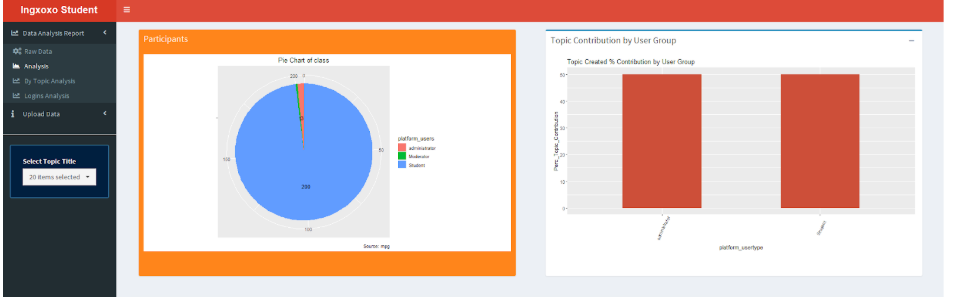
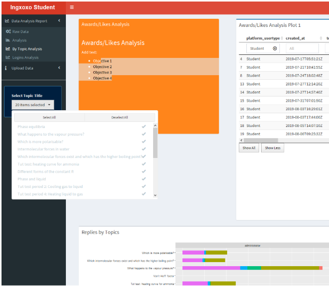

Code developed by Sidney as part of the Ingxoxo Project
README written by @chrisbarnettster


# Requirements

- Ananconda
- Rstudio and R
- Microsoft Visual Code
- Postgresql
- PGAdmin
- Postgres database dump from Discourse Database (private data and not stored here)
- R libraries installed as per install.R

From Sidney - "`Action plan for easy data transition, is to install the PostgreSQL and as well as getting R -version 3.5.1 installed on his machine. For R use Anaconda, loading some packages in R studio directly is challenging so easy to load using terminal
1. https://www.postgresql.org/
2. Install Anaconda
3. Install Microsoft Visual Studio Code
4. For querying using PGAdmin


## Getting data into localdatabase
Postgres data dump from Discourse is a *.sql
Once your postgres local server is running connect to it
probably localhost 5432 with user postgres and password that you know.
CREATE DATABASE ingxoxo
exit
then in a shell that has psqsl in the path, get the data into the database.
psql -h localhost -d ingxoxo -U postgres <  postgresdump.sql

## Running the data analysis app

open server.R in Rstudio
open install.R in Rstudio and run it. This should install all package requirements
edit server.R so that the database access details are correct.

```
dsn_database = "ingxoxo"  
dsn_hostname = "localhost"    
dsn_port = "5432"                
dsn_uid = "postgres"
dsn_pwd = "" # password
```

Run server.R. You will be presented with a Shiny interface and be able to analyse user and topic data. 





# LICENSE

- Code is MIT licenced.
- Any unintentionally shared data of a private nature and containing personal information is private and may not be copied or distributed.
